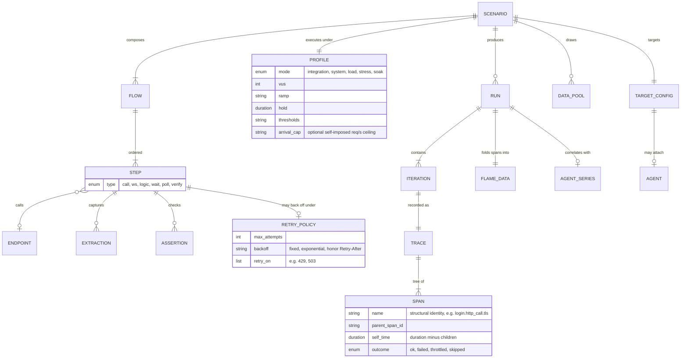
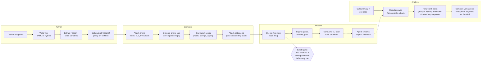
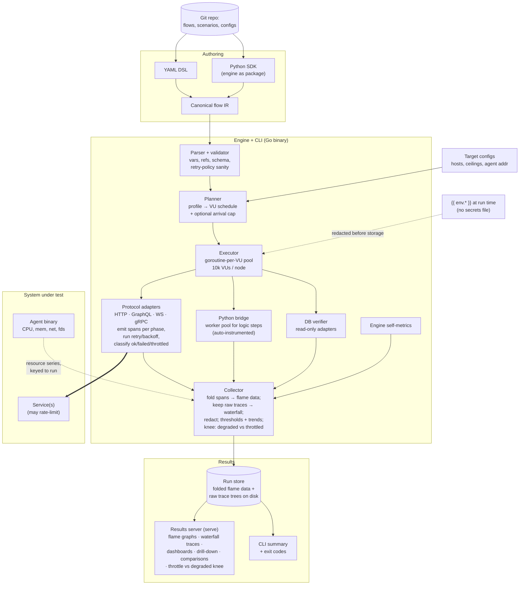
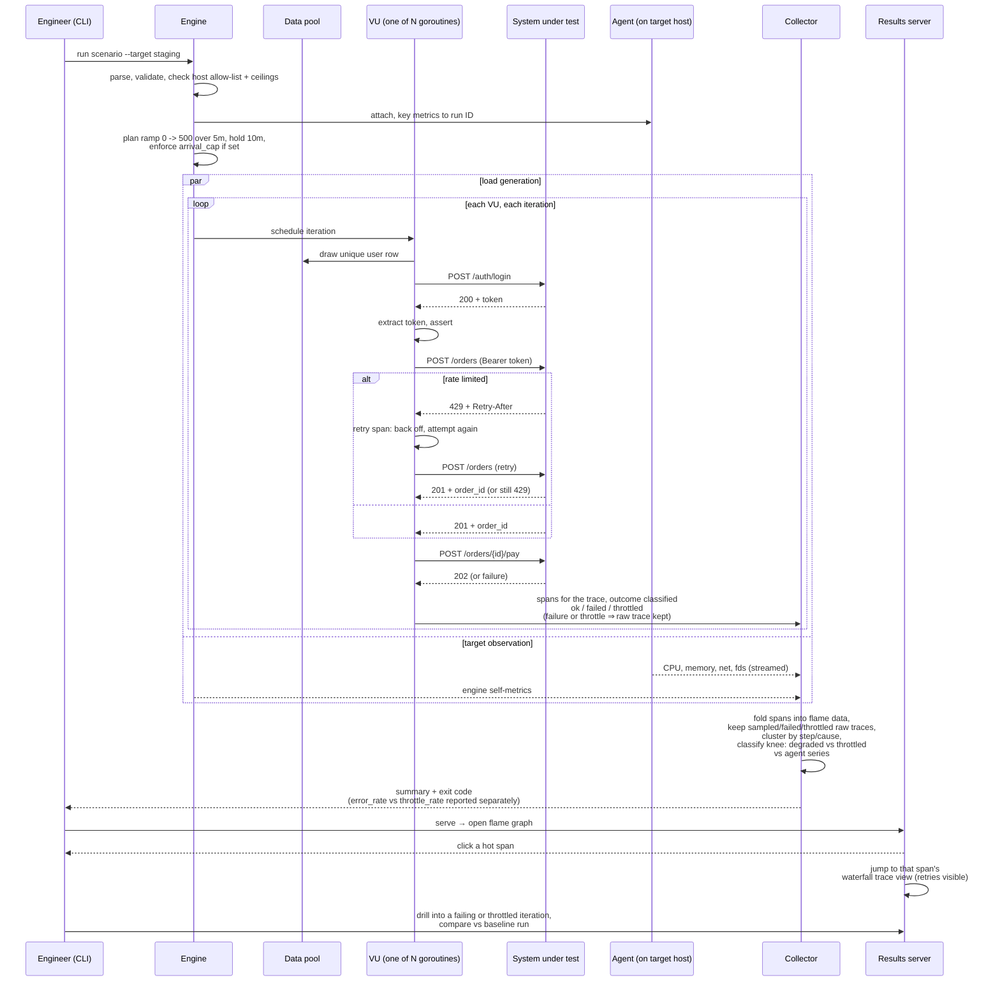

# FlowBench — Product Requirements Document

| Field              | Value                                                                                                                  |
| ------------------ | ---------------------------------------------------------------------------------------------------------------------- |
| **Author**         | Prince Kwabena Appiah Boadu                                                                                            |
| **Status**         | `DRAFT`                                                                                                                |
| **Version**        | v0.4                                                                                                                   |
| **Last updated**   | 2026.07.08                                                                                                             |
| **Target release** | v1, timeline TBD (see Milestones for relative sequencing)                                                              |
| **Shape**          | Tooling packages, not a platform: Go engine + CLI, Python SDK, YAML DSL, embedded results server, target-metrics agent |
| **Audience**       | Internal engineering teams; local-first developer tool                                                                 |

## 1. TL;DR

An internal, scripting-first testing toolkit for API endpoints and multi-step flows. One canonical flow representation is authored either in a declarative YAML DSL or in Python (the engine shipped as an importable package, giving granular programmatic control), and executed by one Go engine built on goroutine-per-VU concurrency, targeting 10k concurrent virtual users on a single node. The four test categories — integration, system, load/stress, and soak — are four **execution profiles** applied to the same flow. Flows chain steps by extracting values from one response and injecting them into later requests (login → take token → act → assert), and a profile decides whether that flow runs once with assertions or ten thousand times under ramped concurrency. Flows live as files in git — with no bespoke secrets mechanism, since credentials are handled the way any script handles them (environment variables, an existing vault). Every step, protocol phase, extraction, assertion, and poll attempt emits a span, and one span model powers two views: **flame graphs** that fold many traces together to show where aggregate time goes (per run or cumulative across runs), and a **waterfall/trace view** that renders one iteration's spans in causal order for debugging exactly how a specific run or failure moved through the flow. Rate limiting is treated as a first-class signal rather than an undifferentiated failure: flows can retry/back off on `429`s, profiles can self-impose an arrival ceiling, and the collector classifies throttled outcomes separately from real failures so thresholds and knee-point findings stay meaningful against rate-limited targets. A lightweight **agent** on the system under test streams CPU/memory/resource metrics into the run, so target saturation, generator saturation, and knee points are never confused. Runs are triggered from the CLI, on demand, on a developer's machine or a beefy node, and inspected through a small embedded results server. This is a set of tooling packages, not a hosted platform; teams, notifications, CI gating, and any product ambitions are explicitly v2.

## 2. Problem

Testing endpoints and cross-module flows today is fragmented across tools that each own a slice of the lifecycle and none of the whole.

- Functional API tests, integration tests, and load tests live in different tools with different syntaxes, so the same flow gets written two or three times and the versions drift.
- Chained flows (authenticate, carry credentials forward, perform a sequence, assert the outcome) are awkward in most load tools and impossible in most API clients at scale.
- Repeating a flow N times under concurrency to find failure patterns requires switching tools entirely, and the failure output rarely shows _which iteration failed on which step with what payload_.
- Performance results are presented as averages and charts, not as a decomposition of _where time actually goes inside the flow_ — there is no flame-graph view of a request chain.
- When a stress run degrades, it is genuinely unclear whether the target broke, the load generator saturated, the network did, or the target's own rate limiter simply did its job — because nobody is watching the target's resources, or classifying throttled responses separately from real errors, in the same pane as the run.

## 3. Vision

One flow definition, four kinds of truth. Write a flow once — in YAML for the common path or Python for full control — and ask the engine different questions of it: _does the data move correctly between modules_ (integration), _does the whole scenario work end to end_ (system), _where does it break under pressure_ (load/stress), and _does it degrade over hours_ (soak).

- **Why scripting-first:** the users are engineers; flows belong in git and in code review. Everything is runnable locally with nothing but the toolkit installed — a developer verifying their own service in a tight loop is a primary use, not an afterthought.
- **Why one engine:** a shared parser/executor guarantees that the flow that passed integration testing is byte-for-byte the flow being stress tested. No translation losses between tools.
- **Why tooling packages, not a platform:** no accounts, no hosted service, no deployment dependency. Install, point at a target, run, inspect. Platform ambitions (teams, hosting, CI service) are deliberately deferred to v2 so v1 stays sharp.

## 4. Target Users and Use Cases

**Primary persona: the backend/service engineer.** Writes flows in Python or YAML, runs them from the CLI against local or shared targets, and inspects results in the embedded results server.

**Secondary persona: the performance investigator.** Runs stress and soak profiles against a service, reads flame graphs and agent overlays to find the bottleneck, and compares runs to confirm a fix.

**Top use cases, prioritized:**

1. As an engineer, I want to define a chained flow (login → extract credentials → perform a series of authenticated calls → assert results) and run it N times concurrently to stress the path and examine every failed instance individually.
2. As an engineer developing locally, I want to run a flow in integration mode against my dev server in seconds, as easily as running a test file, to verify my work before pushing.
3. As an engineer, I want to verify that data flows correctly between modules — call service A, assert the effect is visible via service B (or, where necessary, directly in a database).
4. As an investigator, I want a flame graph of the flow — which step, and which phase within it (connect, TLS, waiting, transfer, logic), consumes the time — for a single run or cumulatively across runs.
5. As an engineer debugging a specific failure, I want to open the exact causal trace of one iteration — what happened, in order, at every step and phase — the way I'd read a browser performance panel, not just an aggregate chart.
6. As an investigator, I want the target's CPU and memory streamed into the run via an agent, so a stress knee or a soak drift is attributable to the right cause.
7. As an engineer testing a rate-limited endpoint, I want the flow to retry with backoff where that's the right behavior, and I want a stress run's knee point to tell me whether I hit a real capacity ceiling or just the target's documented rate limit.
8. As an engineer, I want to compare this run against a baseline run and see regressions highlighted.

## 5. Landscape

Why not adopt an existing tool outright:

- **k6 / Gatling / Artillery:** strong load engines, but functional and integration testing are second-class, per-iteration forensics are thin, none renders a flow as a flame graph, and none offers a native Python authoring surface with granular engine access. k6 is JavaScript-only; Gatling is Scala/Java-centric.
- **Postman / Newman / Insomnia:** good single-request ergonomics, but chained-flow logic is clunky, load testing is shallow, and collections-as-JSON-blobs fight git-based review.
- **pytest + requests + Locust glued together:** the realistic status quo, and the thing this toolkit replaces — the glue is the product. Locust gives Python load testing but no declarative layer, no unified functional mode, weak result inspection, and a Python-bound VU ceiling.
- **pprof / flame-graph tooling:** the inspiration for the results experience — a small local server over profile data — but it profiles a process, not a distributed flow. This toolkit brings that idiom to the request chain.

The differentiator is deliberate: **one canonical flow, two authoring surfaces (YAML and Python), four execution profiles, one Go engine, one result store, one perf-first inspection surface with flow flame graphs and target-side correlation.**

## 6. Goals and Non-Goals

**Goals**

- Make authoring a chained, credential-carrying flow trivial in YAML and fully controllable in Python.
- Collapse integration, system, load/stress, and soak testing into execution profiles over the same flow definition.
- Hit 10k concurrent VUs on a single node with honest measurement, via a Go engine and goroutine-per-VU execution.
- Give first-class failure forensics: per-iteration span traces with request/response capture for failures, grouped by step and cause.
- Ship a perf-first results experience built on one span model: flame graphs of the flow (single-run and cumulative) for aggregate bottlenecks, and a waterfall/trace view for debugging exactly how one iteration moved through the flow — plus latency distributions and run-versus-baseline regression comparison.
- Treat rate limiting as a first-class, mode-aware signal rather than an undifferentiated error, both in how flows respond to it and in how runs report it.
- Ship a lightweight target-metrics agent so target-side resource behavior is part of every run's story.
- Keep everything local-first: flows in git, runs on demand, results on disk, no hosted dependency.

**Non-Goals (v1)**

- No platform. No hosted service, no accounts, no multi-user or team features, no deployment infrastructure. The deliverables are packages and binaries.
- No CI integration in v1. The CLI's design must not preclude it (clean exit codes, machine-readable output), but CI recipes, gating, and pipeline ergonomics are future work.
- No scheduling or recurring runs. Run-now only.
- No notifications (Slack, email). v2.
- No retention policies or artifact lifecycle management. Runs accumulate on disk under the user's control.
- No browser/UI testing and no mobile app testing. This is an API-and-flow tool.
- No general database or message-queue _steps_ as a primary pattern. Where an HTTP endpoint already exercises the flow, the flow is tested through HTTP. A narrow database _verifier_ for assertions is in scope (see 10.4); orchestration over queues and DBs is not.
- No dedicated setup/teardown subsystem. Seeding and cleanup are handled through the Python surface or through test data design — deliberately, to keep the engine lean.
- No OAuth2 authorization-code flow (requires browser interaction). All other common auth schemes are in scope.
- No mocking or service virtualization.
- No distributed rate-limit coordination across multiple generator nodes in v1 (moot at single-node scale, but noted since it would matter if distribution is ever pursued in v2).
- No monetization, packaging, or product positioning. All business questions are v2.

## 7. Success Metrics

|Goal|Signal|Metric|Target|
|---|---|---|---|
|Adoption|Teams write flows|# of flows in repos; # of distinct authors|> [X]|
|Replaces the glue|Runs happen through the engine|Runs per week across users|> [X]|
|Local-dev fit|Fast inner loop|Time from `install` to first integration run|< [X] min|
|Forensics work|Failures get diagnosed in-tool|% of failed runs where an iteration trace is opened|> [X]%|
|Perf value|Bottlenecks found before prod does|# of findings attributed to flame graphs / agent overlays|> [X]/quarter|
|Rate-limit clarity|Stress findings aren't confused with throttling|% of stress runs where the report distinguishes throttled from degraded knee points|> [X]%|
|Engine honesty|10k VUs without lying|Sustained VUs on reference hardware with generator CPU < [X]%|10,000|

**Guardrail metrics:** engine overhead per VU (memory, CPU), metric accuracy versus a reference generator, accidental-target incidents (must be zero), agent overhead on the target (< [X]% CPU).

## 8. Proposed Solution

A single Go engine executes a canonical flow representation. Authoring happens in two surfaces that both produce that representation; execution behavior is entirely determined by the attached profile; inspection happens in an embedded results server over on-disk run artifacts.

**Top value propositions:**

1. **Write once, test four ways.** The same `authenticated_checkout` flow is an integration test at 1 VU, a system test composed with other flows, a stress test at ramped VUs, and a soak test over 8 hours — by swapping a profile block, not rewriting anything.
2. **Chaining as a first-class primitive.** Extract-and-inject between steps (token from login, ID from creation) is the core mechanic in both authoring surfaces, not a scripting trick.
3. **See where the time goes.** Flame graphs decompose the flow into steps and phases, per run or cumulatively across runs, with target-side resource overlays — a profiler's view of a distributed request chain.
4. **Forensics, not just graphs.** Every failure is traceable to an iteration, a step, a request, and a response — captured for all failures, sampled for successes, grouped by step and cause.
5. **Throttling is data, not noise.** A `429` is either a bug or the finding, depending on what you're testing for, and the toolkit keeps those readings separate instead of collapsing them into one error count.

## 9. Conceptual Model

- **Endpoint:** a declared, reusable target — protocol, method/operation, URL or address template, default headers, auth requirement.
- **Flow:** an ordered, optionally branching sequence of **Steps**. Each step calls an endpoint (or runs logic), can **extract** values into flow variables, and can **assert** conditions.
- **Step:** the atomic unit. Types: `call` (HTTP/GraphQL/gRPC), `ws` (WebSocket session operation), `logic` (Python hook), `wait`/`poll-until`, `verify` (database check). `call` steps may carry an optional retry/backoff policy for rate-limited responses (see 10.1).
- **Profile:** the execution contract — mode (`integration | system | load | stress | soak`), VUs, ramp shape, duration or iteration count, thresholds, and an optional arrival-rate cap (see 10.3).
- **Scenario:** one or more flows bound to a profile, a target config, and data pools. The runnable unit.
- **Target Config:** a lightweight named config (local/dev/staging) carrying base URLs, ceilings, and optionally an agent address. Config files, not platform objects. Credentials are not part of it (see Secrets, below).
- **Data Pool:** fixture source (CSV/JSON) with a distribution policy so concurrent VUs draw distinct rows. Fixtures double as the seeding mechanism where flows need pre-existing state.
- **Span:** the atomic unit of tracing. Every step, protocol phase, extraction, assertion, and poll or retry attempt emits a span with a name, parent, start offset, duration, self-time, and outcome. One iteration's spans form a trace tree; this is the single source of truth for both debugging and flame graphs (see section 10.7).
- **Run:** one execution of a scenario, producing aggregate metrics, threshold evaluations, per-iteration traces (span trees), folded flame data, and (if an agent is attached) target resource series. Aggregate metrics distinguish `throttled` outcomes from `failed` outcomes (see 10.7 and section 12).
- **Agent:** a small binary on the system under test streaming resource metrics (CPU, memory, network, descriptors) into the run.
- **Secrets:** not a Flowbench concept. Python flows read credentials the way any Python script does (env vars, an existing vault/secrets CLI); YAML flows resolve `{{ env.VAR_NAME }}` against the process environment at run time. The engine's only responsibility is redaction (see 10.7 and 14).



## 10. Requirements

Organized by the testing lifecycle: **Author → Configure → Execute → Analyze**, plus cross-cutting. Priorities: `[P0]` MVP-blocking, `[P1]` important, `[P2]` nice to have. Surface tags: `(E)` engine, `(Y)` YAML DSL, `(P)` Python SDK, `(C)` CLI, `(R)` results server, `(A)` agent.



### 10.1 Author (flows, endpoints, chaining)

- `[P0]` `(Y)(P)` Users can define flows in a declarative YAML DSL and in Python via the engine as an importable package. Both compile to the same canonical representation.
- `[P0]` `(E)` Steps can extract values from responses (JSONPath for JSON; XPath for XML bodies when SOAP lands) into flow variables, and inject variables into any later step's URL, headers, or body via templating.
- `[P0]` `(E)` Steps can assert on status, latency, headers, and body content; assertion failures are recorded per iteration without necessarily aborting the run (configurable: `abort_flow | abort_run | record`).
- `[P0]` `(E)` A `call` step can declare a retry/backoff policy for rate-limited or transiently unavailable responses: `on_status: [429, 503] -> backoff(strategy, max_attempts)`, where `strategy` is `fixed`, `exponential`, or `honor_retry_after` (respecting a `Retry-After` header when the target sends one). Expressed identically in YAML and Python. Absent a policy, a `429`/`503` is just another response the flow's assertions judge.
- `[P0]` `(E)` Each retry attempt emits its own span nested under the step (reusing the poll-attempt pattern), so a flow that spent most of its time backing off is visible in the waterfall view rather than looking like one slow call.
- `[P0]` `(P)` The Python SDK exposes granular hooks: per-step logic, custom extraction, computed request bodies, conditional branching, loops within a flow, and `poll-until` patterns — so a flow file reads like a normal high-level test file. Seeding and cleanup, where needed, are written as ordinary steps or plain Python around the flow; the engine adds no lifecycle machinery.
- `[P0]` `(Y)` The YAML DSL covers the common path without code: call, extract, assert, template, data-pool reference, simple retry/poll, retry/backoff policy.
- `[P1]` `(E)` Reusable endpoint catalog: declare endpoints once, reference them across flows.
- `[P1]` `(E)` Flow composition: a scenario can run multiple flows in parallel with distinct personas and VU allocations (system testing).
- `[P2]` `(P)` Lua as an additional embedded scripting surface. [Open question; Python may be sufficient.]

### 10.2 Protocols

- `[P0]` `(E)` HTTP/HTTPS (REST): all methods, headers, query/body templating, multipart, redirects, cookie jars per VU.
- `[P0]` `(E)` GraphQL: query/mutation steps with variables, response extraction over the `data`/`errors` shape.
- `[P1]` `(E)` WebSockets: open a session as a step, send/receive/match messages, hold sessions across steps within an iteration, assert on received frames.
- `[P1]` `(E)` gRPC: unary calls from `.proto` definitions; streaming scoped later. [Open question on streaming.] gRPC's `RESOURCE_EXHAUSTED` status maps to the same `throttled` outcome class as HTTP `429`.
- `[P2]` `(E)` SOAP/XML: XML body templating and XPath extraction.
- `[P0]` `(E)` Auth schemes: bearer/JWT (static or extracted at runtime), session cookies, basic auth, API keys (header/query), OAuth2 client-credentials, HMAC request signing. Explicitly excluded: OAuth2 authorization-code.

### 10.3 Configure (profiles, targets, data)

- `[P0]` `(E)(Y)(P)` A profile attaches to a scenario: mode, VUs, ramp shape, hold duration or iteration count, and thresholds (e.g. `p95(latency) < 800ms`, `error_rate < 1%`).
- `[P0]` `(E)` Modes map to the four test categories:
    - **integration** — 1 VU, once (or once per fixture row); assertions are the signal. A `429` here is a real failure, not a finding.
    - **system** — multi-flow composition, end-to-end assertions.
    - **load** — ramp to expected concurrency, hold, evaluate thresholds.
    - **stress** — keep ramping past the ceiling; report identifies the knee point where thresholds break, and states explicitly whether the knee was throttling or genuine degradation (see section 12).
    - **soak** — moderate VUs, long duration; collector evaluates _trends_ (latency creep, error drift, throttle-rate drift, agent-side memory growth) not just point thresholds.
- `[P1]` `(E)(Y)(P)` A profile can declare an optional self-imposed arrival cap (e.g. `arrival_cap: 50/s`), independent of VU count, so a scenario can deliberately test behavior _at_ a known or documented rate limit rather than only discovering the limit by flooding until the target pushes back. The planner enforces the cap at the scheduling layer, ahead of the target.
- `[P0]` `(E)` Target configs are simple files, not platform objects: named configs (local/dev/staging) with base URLs, VU/RPS ceilings, and an optional agent address. Selected per run (`--target dev`). No credentials live in a target config.
- `[P0]` `(Y)` Credentials are not a Flowbench concept, and there is no bespoke secrets file. The YAML DSL resolves `{{ env.VAR_NAME }}` against the process environment at run time; the Python SDK does whatever the surrounding script does (`os.environ`, an existing vault/secrets CLI). This is deliberate: on the primary scripting surface, secrets are just Python, and inventing a parallel mechanism would only duplicate what teams already use.
- `[P0]` `(E)` Redaction is the engine's actual responsibility: any value sourced from `{{ env.* }}` templating, or flagged sensitive by the Python SDK, is scrubbed from captured request/response bodies, traces, and logs before they reach the run store.
- `[P0]` `(E)` Data pools: CSV/JSON fixtures with distribution policies (`unique-per-vu`, `round-robin`, `random`) and defined exhaustion behavior. Uniqueness under concurrency is the engine's responsibility. Fixture design, driven by the spec or request shapes of the system under test, is also the sanctioned mechanism for pre-seeding state.
- `[P1]` `(E)` Synthetic data generators (emails, names, UUIDs, numbers in range) usable inline in templates.

### 10.4 Verification beyond HTTP

- `[P1]` `(E)` A `verify` step type checks state directly in a database when no endpoint exposes it: run a parameterized read-only query against a configured connection and assert on the result (row exists, count, field value). Adapter-based; PostgreSQL first, others by demand.
- `[P1]` `(E)` Database connections are declared per target config, referenced by name, credentialed via `{{ env.* }}` (same mechanism as everywhere else), and **read-only by default**; write access requires an explicit per-connection flag.
- `[P2]` `(E)` A disposable "demo DB" option for scenarios that need a seeded, throwaway database (container spun per run). [Open question on whether this earns its complexity.]

### 10.5 Execute (engine, CLI)

- `[P0]` `(E)` The engine is written in Go with goroutine-per-VU concurrency, sized for **10,000 concurrent VUs on a single node** on reference hardware, with generator self-metrics proving headroom.
- `[P0]` `(E)` The engine pipeline: parse → validate (schema, variable resolution, endpoint references, data-pool shape) → plan (profile → VU schedule, including any arrival cap) → execute (VU pool) → collect → report. Validation failures are pre-run errors with file/line context.
- `[P0]` `(C)` A CLI runs any scenario on demand (`run scenario.yaml --target dev`), streams progress, prints a summary, and exits nonzero on threshold breach. Run-now only; no scheduler.
- `[P0]` `(C)` The local development loop is a first-class path: zero-config defaults for `--target local`, sub-second startup for integration mode, and output terse enough to live in a watch loop.
- `[P0]` `(P)` Python-authored flows run both via the CLI and directly (`python test_checkout.py`), so they behave like normal test files.
- `[P0]` `(E)` Deterministic, honest load generation: open-model or closed-model arrival configurable; latency recording avoids coordinated omission.
- `[P0]` `(E)` Every step, protocol phase (DNS, connect, TLS, time-to-first-byte, transfer), extraction, assertion, and poll/retry attempt emits a span (name, parent, start offset, duration, self-time, outcome). Each iteration's spans form a trace tree — the single data source behind both the waterfall/debug view and flame graphs (10.7).
- `[P0]` `(E)` A response's outcome is classified into one of `ok | failed | throttled | skipped` at the point of assertion, using a per-mode default (see section 12) that is overridable per step. `throttled` covers HTTP `429`, gRPC `RESOURCE_EXHAUSTED`, and any status the flow author explicitly maps to it.
- `[P0]` `(P)` The Python SDK's HTTP client auto-instruments: any call made inside a `logic` step emits child spans under that step, so a Python step with three nested HTTP calls resolves in the flame graph and trace view exactly like a native `call` step — Python is never an opaque blob in the graph.
- `[P1]` `(E)` `poll-until` and retries emit one span per attempt, nested under the step, so "spent 40% of the flow polling or backing off" is visible rather than looking like one slow call.
- `[P1]` `(E)` Graceful stop and abort: a run can be cancelled cleanly (Ctrl-C or via the results server), flushing partial results.
- `[Future]` CI integration: the exit-code and JSON-summary design must not preclude it, but recipes, gating semantics, and pipeline ergonomics are explicitly post-v1.

### 10.6 Target-side agent

- `[P0]` `(A)` A lightweight agent binary runs on the system under test's host and streams resource metrics — CPU, memory, network throughput, open descriptors, load average — to the collector for the duration of a run, keyed to the run ID.
- `[P0]` `(E)` The collector time-aligns agent series with run metrics, so charts and flame views can overlay target resources against VU count, RPS, and latency — including against the throttle-rate series, so it's visible whether resource pressure and rate-limiting rose together (real degradation) or throttling held resource usage flat (a deliberate ceiling doing its job).
- `[P0]` `(E)` The engine records its **own** resource series with the same mechanism, so generator saturation and target saturation are always distinguishable in the same view.
- `[P1]` `(A)` Multi-host: several agents (app node, database node) attached to one run, each labeled.
- `[P1]` `(A)` Agent overhead budget enforced: sampling backs off before the agent itself becomes a measurable load (< [X]% CPU on the target).
- `[P2]` `(A)` Process-level breakdown (per-PID CPU/memory for a named process) in addition to host totals.

### 10.7 Analyze (run store, results server)

- `[P0]` `(E)` Run artifacts persist on disk: aggregate metrics (latency percentiles, throughput, error rate, throttle rate, per-step breakdowns), threshold outcomes, per-iteration trace trees (spans), folded flame data, and agent series. No retention machinery; the store is a directory the user owns.
- `[P0]` `(E)` Two storage tiers, so the tool scales to 10k VUs without either losing debuggability or drowning in raw spans: **(1) folded/aggregated data** — counts and duration sums per structural span-path, updated incrementally as spans stream in, unbounded-VU-safe, and the sole input to flame graphs; **(2) raw trace trees** — kept per the existing capture policy (all failures, plus a configurable sample of successes and throttled responses), and the sole input to the waterfall/debug view.
- `[P0]` `(E)` Capture policy that survives scale: full request/response capture for **all failures** plus a configurable sample of successes and throttled responses; bodies truncated at a size cap; sensitive values redacted per section 10.3.
- `[P0]` `(E)` Step names carry structural identity: folding across iterations and across runs only works if the same step name means the same thing every time. The parser warns when a flow file renames a step that a prior run's data references, since that silently breaks cross-run folding rather than erroring loudly.
- `[P0]` `(R)` A small embedded results server (`serve` command, in the spirit of `go tool pprof -http`) reads the run store and serves the inspection views locally. Not a web app: no accounts, no persistence of its own, no write path beyond triggering abort.
- `[P0]` `(R)` **Flame graphs of the flow** — the headline view, built entirely from folded data. A single iteration renders as flow → steps → phases (dns/connect/tls/ttfb/transfer/logic), unfolded; a single run folds across that run's iterations, width proportional to aggregate time, so the dominant step and phase are visually obvious; a cumulative view folds across multiple selected runs. Clicking a bar jumps to a representative trace's waterfall view for that span.
- `[P0]` `(R)` **Waterfall / trace view** — the debugging companion to the flame graph, built from raw trace trees. Renders one iteration's spans in causal order (start offset, duration, parent/child), the way a browser performance panel renders a page load, including retry/backoff attempts as their own nested spans. For system-mode scenarios with multiple flows/personas running concurrently, parallel traces render as parallel tracks. This is the primary tool for working out exactly how a specific run or a specific failing (or throttled) iteration moved through the flow.
- `[P0]` `(R)` Failure drill-down: outcomes grouped by step and by cause (status, assertion, timeout, connection, throttled), with `throttled` always shown as its own group rather than folded into generic errors, expandable to any individual iteration's waterfall view with captured request/response at each span.
- `[P0]` `(R)` Run dashboard: summary, time-series charts (latency percentiles, RPS, error rate, throttle rate over the run), per-step table, threshold outcomes, with agent overlays (target CPU/memory against the load curve) when an agent was attached.
- `[P0]` `(R)` Stress-mode knee-point reporting states which of two findings occurred: **degraded** (thresholds broke via rising latency/errors, generally correlated with rising target resource usage) or **throttled** (thresholds broke because the throttle rate rose while resource usage stayed flat) — since these call for different follow-up.
- `[P1]` `(R)` Regression comparison: this run versus a chosen baseline run — side-by-side flame graphs, percentile deltas, error-rate deltas, throttle-rate deltas, threshold flips — with regressions highlighted.
- `[P1]` `(R)` Soak trend view: long-horizon charts tuned to drift detection (windowed p95 creep, error drift, throttle-rate drift, target memory growth).
- `[P1]` `(R)` Live view: watch an in-progress run (VUs, RPS, errors, throttle rate, percentiles, agent series) with the same server.
- `[P2]` `(R)` Flow diagram rendering from the IR (nodes = steps, edges = variable dependencies), read-only, as an orientation aid next to the flame graph.

### 10.8 Cross-cutting

- `[P0]` `(E)` Flows, scenarios, profiles, and target configs are files in a git repository, safe to commit as-is since none of them carry credentials. The toolkit imposes a conventional layout but tolerates custom ones.
- `[P0]` `(E)` Safety rails, proportionate to an internal tool: a run is checked against the target config before execution — hosts outside the declared base URLs are refused by default, and VU/RPS ceilings in the config are enforced. High-load modes can be disallowed per target config.
- `[P0]` `(E)(C)` Every run records who ran it, the target, and the git commit of the flow files — the run store is its own audit trail.
- `[P1]` `(E)` Engine self-observability beyond the resource series: structured logs and artifact integrity checks.
- `[Future]` Notifications, teams/permissions, hosted anything: v2.

## 11. Authoring Surfaces

The contract: **both surfaces produce the same canonical flow representation; the engine only ever sees the canonical form.**

**YAML (the common path):**

```yaml
flow: authenticated_checkout
data: fixtures/users.csv        # unique-per-vu by default
steps:
  - id: login
    call: POST /auth/login
    body: { email: "{{ user.email }}", password: "{{ user.password }}" }
    extract: { token: $.data.access_token }
    assert: [ status == 200, token != null ]

  - id: create_order
    call: POST /orders
    headers: { Authorization: "Bearer {{ token }}" }
    body: { items: "{{ user.cart }}" }
    extract: { order_id: $.data.id }
    retry:
      on_status: [429, 503]
      backoff: honor_retry_after
      max_attempts: 5

  - id: pay
    call: POST /orders/{{ order_id }}/pay
    headers: { Authorization: "Bearer {{ token }}" }
    assert: [ status == 202 ]

profile:
  mode: stress
  vus: { ramp: "0 -> 500 over 5m", hold: 10m }
  arrival_cap: 300/s   # optional; test at a known ceiling instead of only discovering one
  thresholds:
    - p95(latency) < 800ms
    - error_rate < 1%     # throttled responses do not count against this in stress mode
```

**Python (granular control, engine as a package):**

```python
from flowbench import Flow, Profile, Retry, expect

flow = Flow("authenticated_checkout", data="fixtures/users.csv")

@flow.step
def login(ctx):
    r = ctx.http.post("/auth/login", json={
        "email": ctx.user["email"],
        "password": ctx.user["password"],
    })
    expect(r.status).to_be(200)
    ctx.vars["token"] = r.json_path("$.data.access_token")

@flow.step(retry=Retry(on_status=[429, 503], backoff="honor_retry_after", max_attempts=5))
def create_order(ctx):
    r = ctx.http.post(
        "/orders",
        headers={"Authorization": f"Bearer {ctx.vars['token']}"},
        json={"items": ctx.user["cart"]},
    )
    ctx.vars["order_id"] = r.json_path("$.data.id")

@flow.step
def pay(ctx):
    r = ctx.http.post(
        f"/orders/{ctx.vars['order_id']}/pay",
        headers={"Authorization": f"Bearer {ctx.vars['token']}"},
    )
    expect(r.status).to_be(202)

if __name__ == "__main__":
    flow.run(Profile(
        mode="stress",
        vus="ramp(0 -> 500, 5m)", hold="10m",
        arrival_cap="300/s",
        thresholds=["p95(latency) < 800ms", "error_rate < 1%"],
    ))
```

The Python surface can go beyond what YAML expresses — conditionals, loops, computed payloads, seeding and cleanup as ordinary code, custom protocols via extension points — while remaining schedulable by the same executor.

**The Go/Python boundary (the one hard engineering problem here):** the executor, scheduler, protocol adapters, and collector are Go; Python enters in two ways. Purely declarative flows (whether authored in YAML or in Python code that only _constructs_ steps) execute entirely on the Go fast path at full VU scale. Flows containing `logic` steps execute those steps in a pool of Python worker processes bridged to the Go engine, which caps their practical VU ceiling below the pure-Go path. The engine reports which path a scenario is on, and the design doc owns the bridge mechanics (IPC protocol, worker pool sizing, backpressure).

## 12. Execution Profiles (the four categories, one mechanism)

This is the load-bearing design decision, so it gets its own section.

|Mode|VUs / shape|Duration|Signal|Typical use|
|---|---|---|---|---|
|integration|1 (or 1 per fixture row)|once|assertions + extraction success|does data flow correctly between modules; local dev verification|
|system|small, multi-flow, multi-persona|once per composition|end-to-end assertions across flows|full scenario truth|
|load|ramp to expected ceiling, hold|minutes|thresholds at steady state|capacity validation|
|stress|ramp past the ceiling until break|until thresholds fail|knee point + failure modes, correlated with agent series, distinguishing throttled from degraded|find the breaking point and what broke|
|soak|moderate, flat|hours|trend evaluation (creep, drift, throttle-rate drift, target memory growth)|leaks and exhaustion|

Three consequences worth stating explicitly:

- **Failure semantics differ by mode.** In integration/system modes an assertion failure is a test failure and should be loud — a `429` here means something is wrong with the test's own arrival rate or the target's config, and is treated as a failure. In load/stress modes individual failures are _data_ — recorded, clustered by step and cause, and counted against `error_rate`, not aborting the run. The `on_failure` behavior defaults sensibly per mode and is overridable per step.
- **Throttled is its own outcome class, not folded into failed.** A response classified `throttled` (HTTP `429`, gRPC `RESOURCE_EXHAUSTED`, or an author-mapped status) is tracked as its own `throttle_rate` metric everywhere. In integration/system modes it counts as a failure by default, since it usually signals a test or config problem. In load/stress/soak modes it is excluded from `error_rate` by default and reported separately — because in those modes, being throttled is frequently the finding, not a defect, and folding it into `error_rate` would make a stress run against a rate-limited endpoint fail by design regardless of the target's actual capacity.
- **The collector changes posture by mode.** Point-in-time thresholds for load/stress; windowed trend analysis for soak (e.g. p95 in hour 6 versus hour 1, agent memory slope, throttle-rate slope); binary assertion outcomes for integration/system. In stress mode specifically, the knee-point finding is qualified as **degraded** (thresholds broke with rising latency/errors and, typically, rising target resource usage) or **throttled** (thresholds broke because throttle rate rose while target resource usage stayed flat) — correlated against the agent series so a deliberate rate limiter isn't mistaken for the target falling over, or vice versa.

## 13. Toolkit Architecture (high level)

Implementation detail belongs in the engine design doc. This is the shape. Deliverables are four artifacts: the **engine+CLI binary** (Go), the **Python SDK package**, the **agent binary** (Go), and the **results server** (embedded in the main binary).

- **Authoring inputs:** YAML files; Python scripts importing the SDK. Both yield the canonical flow IR.
- **Parser + validator:** schema validation, variable-graph resolution (every `{{ var }}` must have an upstream extractor or pool), endpoint reference checks, profile sanity, retry-policy sanity (bounded `max_attempts`, valid backoff strategy).
- **Planner:** converts a profile into a VU schedule (arrival model, ramp segments, stop conditions, optional arrival-rate cap enforced ahead of the target).
- **Executor:** goroutine-per-VU pool; each VU runs iterations with its own cookie jar, data row, and variable scope. Protocol adapters (HTTP, GraphQL, WS, gRPC, later SOAP) behind a common step interface, each call emitting spans for its phases and classifying outcome as `ok | failed | throttled | skipped`. Retry/backoff policies execute within the adapter, honoring `Retry-After` where present. Python `logic` steps route to a bridged worker pool and auto-instrument nested HTTP calls as child spans.
- **Collector:** streams spans into two tiers — folded aggregates (HDR-style latency histograms plus per-span-path duration sums and throttle-rate series, feeding flame graphs) and raw trace trees (kept per capture policy, feeding the waterfall view) — ingests agent series and the engine's own resource series, applies redaction, evaluates thresholds/trends, and classifies stress-mode knee points as degraded versus throttled.
- **Run store:** a directory of run artifacts with an index; everything the results server shows lives here.
- **Results server:** `serve` reads the store and renders flame graphs, dashboards, drill-downs, and comparisons locally. It never talks to the executor except to signal abort during a live run.
- **Agent:** standalone binary on target hosts; streams labeled resource metrics to the collector for the run's duration.



**Execution sequence for the canonical case (chained flow under stress against a rate-limited endpoint, agent attached):**



## 14. Non-Functional Requirements

- **Performance and honesty:** 10,000 concurrent VUs sustained on a single reference node for pure-declarative flows, with the engine's own resource series proving headroom; latency measured with coordinated-omission awareness; the Python-bridge path documents its lower ceiling rather than hiding it. Retry/backoff loops count toward VU occupancy honestly rather than being hidden as free time.
- **Footprint:** per-VU memory overhead low enough that a developer laptop comfortably handles hundreds of VUs; integration mode starts in well under a second for the local dev loop.
- **Reliability:** runs are crash-tolerant (partial artifacts flushed); aborts are clean and propagate to all VUs within [X]s; poll-until and retry/backoff patterns are timeout- and attempt-bounded so a persistently rate-limited target cannot hang a run indefinitely.
- **Determinism where it matters:** integration/system modes produce reproducible orderings; data-pool draws are seedable.
- **Security:** no credential material is ever written into flow, scenario, or target-config files; any value sourced from `{{ env.* }}` or flagged sensitive by the SDK never appears in logs, traces, artifacts, or served views; DB verifier connections read-only by default; the results server binds to localhost by default.
- **Agent discipline:** the agent's own overhead stays below [X]% CPU on the target, backs off its sampling under pressure, and fails open (a dead agent never affects the run, only the overlay).
- **Compatibility:** Linux and macOS for the CLI/engine and agent; the Python SDK supports the org's standard Python versions.

## 15. Safety Rails

An internal stress tool can still cause an internal outage. Defenses are configuration-enforced, not honor-system — but scaled to a local-first tool, not a platform.

- **Host allow-list.** A flow cannot call outside its target config's declared base URLs unless the config explicitly allows it — preventing a copy-pasted flow from hammering the wrong system.
- **Ceilings.** VU/RPS ceilings in the target config are enforced by the planner; high-load modes (`stress`, `soak`) can be disallowed per config. An arrival cap (10.3) is a complementary, author-facing lever for the same goal at the flow/profile level.
- **Attribution.** Every run records initiator, target, and flow-file git commit in the run store — the audit trail is the artifact directory itself.
- **Kill switch.** Ctrl-C and a results-server abort both stop a run cleanly, propagating to all VUs within [X]s.

## 16. Instrumentation of the Toolkit

|Event|Trigger|Key properties|Powers|
|---|---|---|---|
|run_started|scenario execution begins|mode, target, vus, arrival_cap, initiator|adoption, audit|
|run_completed|run ends|status, duration, thresholds passed/failed, error_rate, throttle_rate, agent attached (y/n)|reliability, value|
|run_aborted|manual or safety abort|reason|guardrail|
|threshold_breached|a threshold fails mid-run or at evaluation|threshold, value|core signal|
|knee_point_found|stress mode identifies a breaking point|classification (degraded / throttled)|core signal|
|flame_viewed|a flame graph is opened|single vs cumulative|perf-value signal|
|failure_trace_opened|a user drills into a failing or throttled iteration|run, step, cause group|forensics value|
|comparison_viewed|baseline comparison opened|runs compared|regression-detection value|
|safety_block|a run refused by target-config rules|rule|guardrail (should be rare but nonzero)|
|bridge_engaged|a run used the Python logic path|worker count|informs bridge investment|

## 17. Dependencies, Risks, and Open Questions

**Dependencies**

- Go toolchain and a reference load-generation node for the 10k-VU benchmark.
- The Go↔Python bridge design (owned by the engine design doc) — the SDK's ergonomics depend on it.
- A span/trace storage format (an OTel-shaped span is the working model; whether to store it in an OTel-compatible encoding or a bespoke compact format is an engine design decision) and a matching flame-graph rendering approach for the results server (build on an existing renderer versus in-house).
- A waterfall/trace-view rendering approach for the results server, ideally sharing a component library with the flame graph since both read the same span data.

**Assumptions**

- Users are comfortable in git and Python; YAML covers the rest.
- Single-node generation at 10k VUs covers v1; distribution is v2 at the earliest.
- Fixture-driven seeding plus Python-side setup code covers lifecycle needs without engine machinery.
- Rate limiting encountered in practice is expressible as status-code-triggered backoff (429/503, gRPC RESOURCE_EXHAUSTED); more exotic signaling (custom headers requiring bespoke parsing beyond `Retry-After`) is handled via the Python surface if it comes up.

**Risks and mitigations**

|Risk|Likelihood|Impact|Mitigation|
|---|---|---|---|
|Two authoring surfaces drift from one IR|M|H|IR is the only executor input; conformance test suite runs every DSL feature through both surfaces|
|Go↔Python bridge underdelivers (latency, complexity)|M|H|Pure-declarative fast path is bridge-free and covers most stress cases; bridge prototyped in M1 before the SDK surface freezes|
|Span volume at 10k VUs overwhelms storage|H|M|Two-tier model: folding happens incrementally in the collector and is the only path to flame graphs; raw trace trees are kept only for failures/throttled plus a sample|
|Capture volume explodes at high VUs|H|M|Failures-plus-sample policy by default, size caps, redaction|
|Step renames silently break cross-run folding|M|L|Parser warns when a step name a prior run's flame data depends on disappears from the flow file|
|Rate-limited targets produce misleading stress results if throttling is counted as generic error|H|H|`throttled` is a first-class outcome class, excluded from `error_rate` by default in load/stress/soak, with its own metric and its own knee-point classification|
|Retry/backoff loops mask a real capacity problem behind apparent success|M|M|Retry attempts are spanned individually and visible in the waterfall; aggregate time-to-success (including backoff) is reported alongside raw success rate so masked latency isn't invisible|
|Accidental internal DoS|L|H|Host allow-lists, ceilings, kill switch (section 15), optional arrival cap|
|Agent skews the measurement it exists to provide|L|M|Overhead budget, sampling backoff, fail-open design|
|Scope creep toward platform features|M|M|Non-goals enforced at review; v2 list is where those conversations go|

**Open questions**

- [ ] Name. Owner: [name]. By: [date].
- [ ] Go↔Python bridge mechanism (subprocess pool over gRPC/stdin, versus embedded interpreter). Owner: [name]. By: [date].
- [ ] Flame-graph and waterfall renderer: adopt existing components (e.g. speedscope-style for flame, a Chrome-DevTools-panel-style component for waterfall) versus build. Owner: [name]. By: [date].
- [ ] Span storage encoding: OTel-compatible (interoperates with existing tracing tools if the org has them) versus a bespoke compact format optimized for the fold operation. Owner: [name]. By: [date].
- [ ] Agent transport and format (push to collector over gRPC? scrape?). Owner: [name]. By: [date].
- [ ] Default retry/backoff parameters (max attempts, base delay for exponential) when a flow declares `retry` without specifying them fully. Owner: [name]. By: [date].
- [ ] Whether the arrival cap (10.3) should be a hard scheduling constraint or a soft target the planner approximates under load. Owner: [name]. By: [date].
- [ ] Lua as a third surface, or Python-only. Owner: [name]. By: [date].
- [ ] gRPC streaming scope in v1. Owner: [name]. By: [date].
- [ ] Demo/disposable DB feature — worth the complexity? Owner: [name]. By: [date].
- [ ] Team size and timeline, so Milestones become dated. Owner: [name]. By: [date].

**Deferred to v2 (decided, not open):** CI integration and gating recipes; scheduling and recurring runs; notifications; teams, permissions, and any hosted/platform posture; retention policies; distribution across load-generator nodes (and any resulting need for distributed rate-limit coordination); productization and all business questions.

## 18. Rollout

- **Phasing:** engine + CLI dogfooded by the authoring team on one real service → two pilot teams write flows for their own services → org-wide availability of the toolkit packages.
- **Entry criteria per phase:** conformance suite green across both surfaces; 10k-VU benchmark met on the reference node; a stress-run finding reproduced against a known bottleneck with the flame graph pointing at the right step, including at least one reproduced case of a stress run correctly identifying a throttled (not degraded) knee point.
- **Distribution:** the engine/CLI and agent as versioned binaries; the SDK as an internal Python package. Install-to-first-run under [X] minutes.
- **Docs:** a quickstart (one YAML flow to first stress run and flame graph in under ten minutes), the DSL/SDK reference, and a cookbook of login-chained and retry/backoff patterns.

## 19. Milestones (relative; dated once team size lands)

|Milestone|Scope|
|---|---|
|M1: Engine core|Canonical IR, parser/validator, HTTP adapter emitting spans per phase, extract/assert/template chaining, YAML surface with `{{ env.* }}` resolution, data pools, target configs, CLI with integration mode (local dev loop), Go↔Python bridge prototype|
|M2: The four modes|Planner + goroutine VU executor toward the 10k benchmark, load/stress/soak profiles, arrival-cap enforcement, retry/backoff policy execution and outcome classification (ok/failed/throttled), thresholds and trend evaluation, two-tier span storage (folded + raw trace trees), capture policy and redaction, run store, safety rails|
|M3: Python SDK + protocols + agent|Engine as importable package with granular hooks and HTTP auto-instrumentation, GraphQL, WebSockets, gRPC unary (with RESOURCE_EXHAUSTED mapped to throttled), auth scheme coverage, DB verifier (read-only, Postgres), agent v1 with run-store correlation|
|M4: Results server|Flame graphs (single + cumulative) and the waterfall/trace debug view over the same span data, dashboards with agent overlays and throttle-rate charting, failure drill-down grouped by step/cause with throttled as its own group, degraded-vs-throttled knee-point reporting, regression comparison, soak trend view, live view, hardening and dogfood exit|

> _M1+M2 alone already replace the pytest-plus-Locust glue for HTTP services; M3 and M4 are where the differentiation compounds — the agent, the flame graphs, the waterfall trace view, and honest throttle-aware stress reporting are what no off-the-shelf combination gives you. If scope pressure hits, SOAP, Lua, and the demo DB are the first deferrals; the IR, chaining, profile mechanics, span emission, outcome classification, and the results server are the protected core._

## Appendix

**Glossary**

- **Flow:** the ordered sequence of steps; the unit of authorship.
- **Profile:** the execution contract that turns one flow into any of the four test categories.
- **Scenario:** flow(s) + profile + target config + data pools; the runnable unit.
- **IR (canonical flow representation):** the single structure both authoring surfaces compile to and the only thing the executor accepts.
- **VU (virtual user):** one concurrent executor of iterations (a goroutine), with isolated variables, cookies, and data rows.
- **Span:** the atomic unit of tracing — a named, timed node (step, protocol phase, extraction, assertion, poll or retry attempt) with a parent, a duration, and a self-time (duration minus children's time).
- **Trace:** one iteration's spans, assembled into a tree in causal order; the input to the waterfall view.
- **Flame graph (of a flow):** a fold of many traces — spans with the same structural name collapsed and summed — rendered as width-proportional time, for one iteration (unfolded), one run, or cumulatively across runs. Answers "where does aggregate time go."
- **Waterfall / trace view:** a causal, per-iteration rendering of one trace's spans in start-offset order, like a browser performance panel. Answers "what exactly happened, in order, in this one run."
- **Throttled:** the outcome class for rate-limit responses (HTTP `429`, gRPC `RESOURCE_EXHAUSTED`, or an author-mapped status), tracked separately from `failed` so thresholds and knee-point findings aren't skewed by a rate limiter doing its job.
- **Arrival cap:** an optional, self-imposed request-rate ceiling set on a profile, enforced by the planner ahead of the target, for testing behavior at a known rate rather than only discovering a limit by flooding.
- **Agent:** the small binary on target hosts streaming resource metrics into a run.
- **Knee point:** the concurrency level at which thresholds begin to fail during a stress ramp, classified as **degraded** (real capacity limit) or **throttled** (rate limiter engaging).
- **Coordinated omission:** the measurement error where a slow target quietly suppresses request attempts, flattering latency stats; the engine must account for it.

**Conventional repository layout**

```
tests/
  endpoints/        # reusable endpoint catalog
  flows/            # *.flow.yaml and *.py flow files
  scenarios/        # flow + profile + target bindings
  fixtures/         # data pools (csv/json); also the seeding lever
  targets/          # local.yaml, dev.yaml, staging.yaml (no credentials)
runs/               # run store (git-ignored); folded flame data + raw
                    # trace trees; `serve` reads from here
```